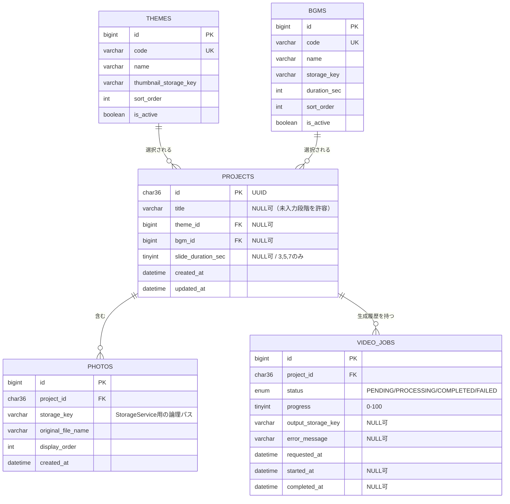

# データベース設計

## 1. ER図



## 2. テーブルごとの設計理由

### 2.1 `projects` — スライドショー1件を表す中心エンティティ

- **なぜ必要か**: 「1つのスライドショー」というMVPの中心概念をそのままテーブル化したもの。写真・動画生成履歴はすべてこのエンティティに従属する。
- **PKにUUIDを採用した理由**: MVPには認証がなく、URL（例: `/projects/{id}/...`）だけでアクセス制御を代替する。連番IDだと他人のプロジェクトIDを推測されるリスクがあるため、推測困難なUUIDを採用する。子テーブル（photos, video_jobs）は性能面を優先しBIGINT連番PKとし、`project_id`カラムでUUIDを参照する。
- **`title` / `theme_id` / `bgm_id` / `slide_duration_sec` をNULL許容にした理由**: ウィザードは「写真アップロード時点でプロジェクト行を作成し、以降の画面で徐々に値を埋めていく」という流れを想定している。よってDB上は入力途中の状態を許容し、**動画生成を許可する条件（全項目が入力済み）はサービス層でバリデーションする**（DB制約に持たせすぎるとウィザードの柔軟性を損なうため）。
- **`slide_duration_sec`**: 選択肢が3/5/7秒の3値のみのため、別テーブル化はオーバーエンジニアリングと判断。`CHECK (slide_duration_sec IN (3,5,7))` をDB制約として付与し、アプリ側のEnumと二重に保護する。

### 2.2 `photos` — Projectに従属する独立テーブル

- **なぜ独立テーブルか**: 1プロジェクトに対し100〜300枚という可変数の写真を持つため、正規化された1対多の子テーブルとする。
- **`storage_key`（`file_path`ではなく）とした理由**: システム設計で定義した`StorageService`は「ローカルディスクかS3か」を抽象化する。実体パスではなく「ストレージ実装が解決できる論理キー」として持たせることで、将来ローカル→S3移行時にテーブル構造・アプリコードとも変更不要にする（例: `projects/{projectId}/photos/{uuid}.jpg`というキーを、ローカルなら`uploads/`配下のパスとして、S3ならオブジェクトキーとしてそのまま解決できる）。
- **`display_order`**: 並び替え結果を保持する整数値。並び替えAPIはプロジェクト単位で「写真ID配列」を受け取り、トランザクション内で`display_order`を0始まりの連番に一括更新する設計とする（DB側でUNIQUE制約は付けない。更新途中の一時的な重複を許容しないと、1件ずつのUPDATEでは制約違反が発生するため。整合性はサービス層のトランザクション内で保証する）。
- **将来のキャプション・表示時間個別設定への対応**: `caption VARCHAR NULL`や`display_duration_sec INT NULL`といったカラムを後から追加するだけで対応でき、テーブル分割やリレーション変更は不要（＝要件のスコープ外機能に対する設計配慮）。

### 2.3 `video_jobs` — 動画生成の履歴を保持する子テーブル

- **なぜProjectと1対多にしたか**: 動画は「イメージと違ったので撮り直したい」等の理由で何度も再生成され得る。1対1（Projectに動画情報を直接持たせる）にすると再生成のたびに前回情報を上書きしてしまい履歴が失われるため、独立した子テーブルとして1対多にする。
- **`status`（Enum）**: `PENDING`（受付済み・未着手）→ `PROCESSING`（FFmpeg実行中）→ `COMPLETED` or `FAILED` という状態遷移をアプリ側のEnumとDBのEnum型で一致させる。フロントの進捗ポーリング（`GET /api/video-jobs/{id}`）はこの値を見て表示を切り替える。
- **`progress`（0〜100）**: FFmpeg実行中の疑似的な進捗（処理済み写真数 / 総写真数などから算出）をパーセンテージで保持し、プログレスバー表示に使う。
- **`error_message`**: 「エラー時はわかりやすいメッセージを表示する」という非機能要件に対応するため、内部エラーとは別にユーザー向け文言を保持できるようにする。
- **将来の拡張**: このテーブルがあることで「過去に生成した動画一覧から再ダウンロード」機能や、失敗履歴を用いた運用調査が自然に実現できる。

### 2.4 `themes` / `bgms` — マスタテーブル（MVPではDBに「選択肢の情報」のみを持たせる）

- **なぜ必要か**: 「テーマ・BGMを将来追加できる設計」という要件に対し、コード上のswitch文等ではなくDBレコードとして管理することで、**コード変更なしにレコード追加のみで選択肢を増やせる**ようにする（ここは変更なし）。
- **テーマの詳細設定はJSON化せず、コード側に持たせる方針に変更**: 当初案ではフレーム/アニメーション/背景の設定をJSON列で保持する案だったが、MVPではテーマ数が4種類程度から始まる小規模な段階であるため、以下の理由からDBのJSON管理を見送り、`videojob`パッケージ内のコードとして実装する。
  - JSONで持たせても結局アプリ側でパースして意味づけする必要があり、テーマ数が少ないうちはコードで直接表現したほうがシンプルで型安全（コンパイル時にミスを検知できる）。
  - JSONスキーマの妥当性検証やマイグレーション時の互換性維持といった、今は不要な複雑さを避けられる（YAGNI: 将来必要になった時点で「設定の外部化」を検討すればよい）。
  - 実装イメージ: `theme.code`（`simple`/`cute`/`graduation`/`sports`）ごとに`ThemeRenderer`（Strategyパターン）を用意し、`VideoGenerationService`が`code`に応じたRendererを選んでFFmpegのフィルタコマンドを組み立てる。詳細はStep8（バックエンド実装）で扱う。
  - そのため`themes`テーブルは「選択画面に表示するための情報」（表示名・サムネイル画像・表示順・有効/無効）のみを持つシンプルな構成にする。
- **`thumbnail_storage_key`**: テーマ選択画面はアイコン・プレビュー画像で視覚的に選ばせる想定のため、表示用サムネイル画像への参照のみを持たせる（`photos`と同様にStorageService経由で解決する論理キー）。
- **`code`（一意な文字列キー）**: `simple` / `cute` / `graduation` / `sports`のような不変な識別子。フロントの表示ロジックやAPIのやり取り、および上記`ThemeRenderer`の選択キーとしてこの`code`を使い、`id`はDB内部の結合用に留める。
- **`is_active`**: 将来「季節限定テーマを一時的に非表示にする」等の運用を、レコード削除ではなく論理無効化で行えるようにする（MVPの範囲でも実装コストがほぼゼロなため残す）。

## 3. 最新動画へのアクセス方法

### 採用案: `latest_video_job_id` カラムは持たせず、クエリで都度取得する

```sql
SELECT * FROM video_jobs
WHERE project_id = ? AND status = 'COMPLETED'
ORDER BY completed_at DESC
LIMIT 1;
```

このクエリを高速化するため `video_jobs (project_id, status, completed_at)` に複合インデックスを張る。

**理由**

1. **単一の情報源（Single Source of Truth）を保てる**。`projects.latest_video_job_id`のような列を持たせると、動画生成が完了するたびに「`video_jobs`の状態更新」と「`projects`の参照列更新」という2箇所の書き込みが必要になり、片方を更新し忘れるとポインタが古いままになるバグを生みやすい。
2. **1プロジェクトあたりのジョブ数は現実的に少数**（再生成しても数件程度）であり、都度クエリしても性能上の懸念はない。将来ジョブ数が増えて問題になった場合のみ、インデックスの見直しやキャッシュ導入で対応すれば十分（MVPで先回りして複雑化しない）。
3. **「進行中のジョブ」と「直近の完成動画」を同時に扱いやすい**。例えばプレビュー画面では「現在処理中のジョブ」を、ダウンロード画面では「直近の完成ジョブ」を見たいが、これは`status`条件を変えるだけのクエリで両方表現できる。単一のFK列では両方の意味を同時に表現しづらい。

**検討した代替案**: `projects.latest_video_job_id`（FK, NULL可）を持たせる案も選択肢としてはあり得る。「現在の対象動画」を明示的なリレーションとして表現でき、ORM（JPA）上も`project.getLatestVideoJob()`のような直感的なアクセスができる利点がある。ただし前述の書き込み二重管理のリスクがあるため、採用するなら「ジョブのstatusをCOMPLETEDに更新するのと同一トランザクション内で必ずこの列も更新する」という運用ルールをService層で徹底する必要がある。MVPではシンプルさを優先し、クエリ方式を採用する。

## 4. その他の設計メモ

- 全テーブルに`created_at`（一部`updated_at`）を持たせ、運用調査やデバッグ時の時系列把握を容易にする。
- 外部キーは基本 `ON DELETE CASCADE`（`photos`, `video_jobs`）とし、プロジェクト削除時に関連データが自動的に削除されるようにする（MVPではプロジェクト削除UIはないが、将来の運用・データ整理を見越した設計）。
- スキーマ変更はFlywayマイグレーション（`db/migration/V1__init_schema.sql`など）で管理し、`themes`/`bgms`の初期データもマイグレーションのseedスクリプトとして投入する。
